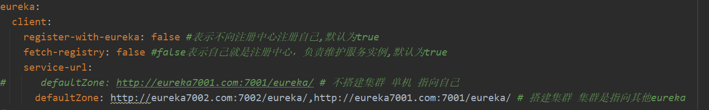
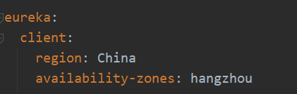
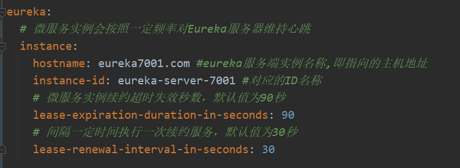
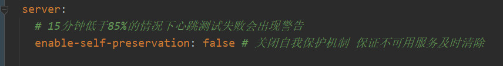
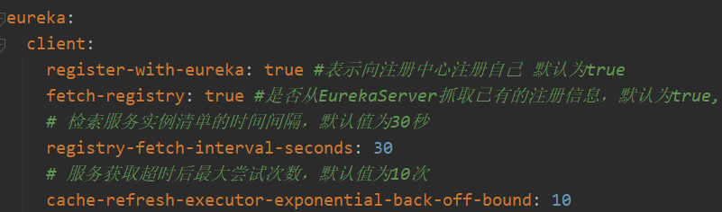
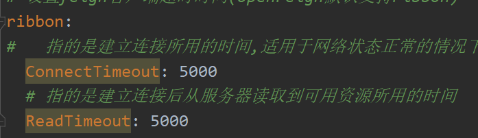
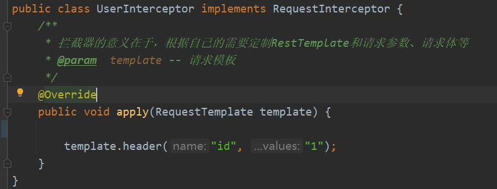
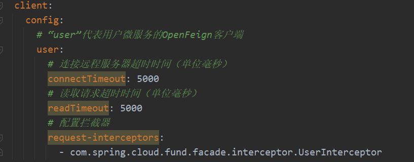
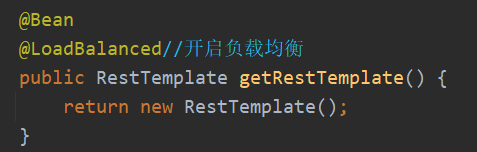
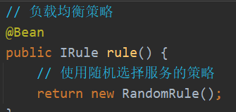

## SpringCloud


数据库建表

```mysql
create database db2019;

CREATE TABLE `payment`
(
    `id`     bigint(20) NOT NULL AUTO_INCREMENT COMMENT 'ID',
    `serial` varchar(200) DEFAULT '',
    PRIMARY KEY (`id`)
)ENGINE = InnoDB AUTO_INCREMENT=1 DEFAULT CHARSET=utf8
```


### 1.Eureka


#### 1.1 注册



Region和zone




#### 1.2 续约



#### 1.3 下线


#### 1.4 自我保护




#### 1.5 微服务之间的相互调用

##### 1.5.1 服务获取




##### 1.5.2 服务调用


### 2.Openfeign

OpenFeign使用步骤：

1.创建OpenFeign的客户端接口

2.在主启动类上声明@EnableFeignClient


#### 1.依赖关系


#### 2.Feign客户端超时时间：默认等待一秒钟，超时会异常报错




#### 3.@configuration

#### 4.OpenFeign拦截器

##### 4.1 实现RequestInterceptor接口，重写apply方法






### 3.Ribbon

#### 3.1 创建RestTemplate的Spring Bean进行开启负载均衡



#### 3.2 使用RestTemplate提供的远程服务调用进行访问其他微服务的接口

例如现在支付模块微服务存在两个实例，访问地址前缀加入该支付模块的服务名称（spring.application.name）并进行不断的访问便可让Ribbon采用负载均衡策略路由到这两个实例进行调用


#### 3.3 负载均衡实现原理

使用LoadBalancerInterceptor对标注@LoadBalanced注解的RestTemplate进行拦截，再调用LoadBalancerClient接口实现类的execute方法执行请求

#### 3.4 负载均衡策略


> **RoundRobinRule** 轮询
> **RandomRule** 随机
> **AvailabilityFilteringRule** 会先过滤掉由于多次访问故障而处于断路器跳闸状态的服务，还有并发的连接数超过阈值的服务，然后对剩余的服务列表进行轮询
> **WeightedResponseTimeRule** 权重 根据平均响应时间计算所有服务的权重，响应时间越快服务权重越大被选中的概率越高。刚启动时，如果统计信息不足，则使用轮询策略，等信息足够，切换到 **WeightedResponseTimeRule**
> **RetryRule** 重试 先按照轮询策略获取服务，如果获取失败则在指定时间内重试，获取可用服务
> **BestAvailableRule** 选过滤掉多次访问故障而处于断路器跳闸状态的服务，然后选择一个并发量最小的服务
> **ZoneAvoidanceRule** 符合判断server所在区域的性能和server的可用性选择服务（默认的选择策略，在存在Zone概念且Zone数量大于1的时候，会先过滤掉负载大的或者有故障的服务）

#### 3.5 使用自定义的负载均衡算法

##### 3.5.1 全局配置




##### 3.5.2 局部自定义配置

1.通过yml配置文件设置

IPing接口负责检测服务的心跳（心跳监测类）


通过和Eureka服务治理中心通信的机制来判定（检测服务的心跳）

2.通过使用@RibbonClient注解（FundCon类不能放在SpringBoot主入口文件可扫描的范围内，否则@RibbonClient优先级低于其配置策略，会对全局生效）


#### 3.6 其他配置

spring.cloud.loadbalancer.retry.enabled默认值为true（Ribbon默认情况下会为我们进行重试请求）

<service-id>.ribbon.xxxx


通过使用饥渴加载Ribbon

第一次Http请求的时候需要初始化Ribbon和发送Http请求，因此会出现耗时比较长的情况。使得第一次服务调用出现超时


### 4.Hystrix


#### 4.1 驱动Hystrix模块

1. 导入依赖，在主启动类上加入@EnableCircuitBreaker注解，驱动断路器
2. 在服务模块即controller层里编写逻辑代码
3. 定义用户服务调用接口
4. 使用用户服务调用（通过在方法上加入@HystrixCommand）


```java
@Service
public class UserFacadeImpl implements UserFacade {
    // 注入RestTemplate，在Ribbon中我们标注了@LoadBalance，用以实现负载均衡
    @Autowired
    private RestTemplate restTemplate = null;

    @Override
    // @HystrixCommand将方法推给Hystrix进行监控
    // 配置项fallbackMethod指定了降级服务的方法
    @HystrixCommand(fallbackMethod = "fallback1")
    public ResultMessage timeout() {
        String url = "http://USER/hystrix/timeout";
        return restTemplate.getForObject(url, ResultMessage.class);
    }

    @Override
    @HystrixCommand(fallbackMethod = "fallback2")
    public ResultMessage exp(String msg) {
        String url = "http://USER/hystrix/exp/{msg}";
        return restTemplate.getForObject(url, ResultMessage.class, msg);
    }

    // 降级方法1
    public ResultMessage fallback1() {
        return new ResultMessage(false, "超时了");
    }

    /**
     * 降级方法2，带有参数
     * @Param msg -- 消息
     * @Return ResultMessage -- 结果消息
     **/
    public ResultMessage fallback2(String msg) {
        return new ResultMessage(false, "调用产生异常了，参数:" + msg);
    }
```


### 5.Zuul


> 当使用作者给的代码在console中运行时发现只有demolog之类的信息，通过百度后发现使用该命令即可查询

```http
GET /zipkin*/_search
```


