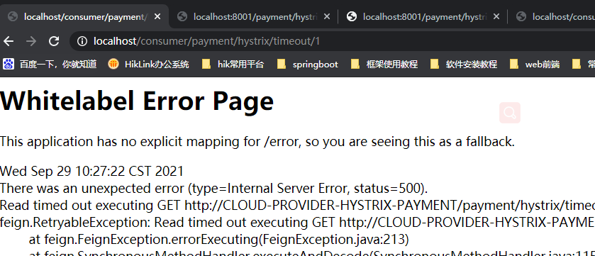

## SpringCloud


数据库建表

```mysql
create database db2019;

CREATE TABLE `payment`
(
    `id`     bigint(20) NOT NULL AUTO_INCREMENT COMMENT 'ID',
    `serial` varchar(200) DEFAULT '',
    PRIMARY KEY (`id`)
)ENGINE = InnoDB AUTO_INCREMENT=1 DEFAULT CHARSET=utf8
```


### 1.Eureka


#### 1.1 注册


Region和zone


#### 1.2 续约


#### 1.3 下线


#### 1.4 自我保护


#### 1.5 微服务之间的相互调用

##### 1.5.1 服务获取


##### 1.5.2 服务调用


### 2.OpenFeign

> OpenFeign是一种声明式调用，按照一定的规则描述接口就能够帮助我们完成REST风格的调用，减少代码的编写量，提高代码可读性。规则中完全采用了Spring MVC的风格实现服务调用的功能。

OpenFeign使用步骤：

1.创建OpenFeign的客户端接口

2.在主启动类上声明@EnableFeignClient


#### 1.Feign客户端超时时间：默认等待一秒钟，超时会异常报错

```yaml
# Ribbon配置
ribbon:
  # 连接服务器超时时间（单位毫秒）
  connectTimeout: 3000
  # 调用超时时间（单位毫秒）
  readTimeout: 6000

# Hystrix配置
hystrix:
  command:
    default:
      execution:
        timeout:
          # 是否启用Hystrix超时时间
          enable: true
        isolation:
          thread:
            # 配置Hystrix断路器超时时间（单位毫秒）
            timeoutInMilliseconds: 5000
```

> 配置Ribbon超时原因：底层使用ribbon进行服务间调用


#### 2.配置OpenFeign


##### 2.1 OpenFeign拦截器

###### 实现RequestInterceptor接口，重写apply方法


> 全局配置，拦截器UserInterceptor可以对OpenFeign客户端接口的所有请求进行拦截，request-interceptors可以配置多个拦截


##### 2.2 使用配置类组装OpenFeign组件

```java
@Configuration
public class FeignConfig {
    /**
     *  创建拦截器
     * @return 拦截器
     */
    @Bean
    public RequestInterceptor userInterceptor() {
        return new RequestInterceptor() {
            @Override
            public void apply(RequestTemplate requestTemplate) {
                requestTemplate.header("id",1);
            }
        };
    }

    /**
     * FeignClient日志级别配置
     *
     * @return 日志级别
     */
    @Bean
    public Logger.Level feignLoggerLevel() {
        // 请求和响应的头信息,请求和响应的正文及元数据
        return Logger.Level.FULL;
    }
}
```


### 3.Ribbon

#### 3.1 创建RestTemplate的Spring Bean进行开启负载均衡


#### 3.2 使用RestTemplate提供的远程服务调用进行访问其他微服务的接口

例如现在支付模块微服务存在两个实例，访问地址前缀加入该支付模块的服务名称（spring.application.name）并进行不断的访问便可让Ribbon采用负载均衡策略路由到这两个实例进行调用


#### 3.3 负载均衡实现原理

使用LoadBalancerInterceptor对标注@LoadBalanced注解的RestTemplate进行拦截，再调用LoadBalancerClient接口实现类的execute方法执行请求

#### 3.4 负载均衡策略


> **RoundRobinRule** 轮询
> **RandomRule** 随机
> **AvailabilityFilteringRule** 会先过滤掉由于多次访问故障而处于断路器跳闸状态的服务，还有并发的连接数超过阈值的服务，然后对剩余的服务列表进行轮询
> **WeightedResponseTimeRule** 权重 根据平均响应时间计算所有服务的权重，响应时间越快服务权重越大被选中的概率越高。刚启动时，如果统计信息不足，则使用轮询策略，等信息足够，切换到 **WeightedResponseTimeRule**
> **RetryRule** 重试 先按照轮询策略获取服务，如果获取失败则在指定时间内重试，获取可用服务
> **BestAvailableRule** 选过滤掉多次访问故障而处于断路器跳闸状态的服务，然后选择一个并发量最小的服务
> **ZoneAvoidanceRule** 符合判断server所在区域的性能和server的可用性选择服务（默认的选择策略，在存在Zone概念且Zone数量大于1的时候，会先过滤掉负载大的或者有故障的服务）

#### 3.5 使用自定义的负载均衡算法

##### 3.5.1 全局配置


##### 3.5.2 局部自定义配置

1.通过yml配置文件设置

IPing接口负责检测服务的心跳（心跳监测类）


通过和Eureka服务治理中心通信的机制来判定（检测服务的心跳）

2.通过使用@RibbonClient注解（FundCon类不能放在SpringBoot主入口文件可扫描的范围内，否则@RibbonClient优先级低于其配置策略，会对全局生效）


#### 3.6 其他配置

spring.cloud.loadbalancer.retry.enabled默认值为true（Ribbon默认情况下会为我们进行重试请求）

<service-id>.ribbon.xxxx


通过使用饥渴加载Ribbon

第一次Http请求的时候需要初始化Ribbon和发送Http请求，因此会出现耗时比较长的情况。使得第一次服务调用出现超时


### 4.Hystrix

> Hystrix是一种断路器组件，用来保护微服务系统在一些糟糕的情况下尽量保证可用性，保护微服务的运行

为什么需要Hystrix？

> 当正常访问接口时，在同一时间请求少的情况下可以瞬间响应，但在高并发情况下则会产生延迟的现象，特别是在使用Ribbon进行不同微服务间调用的时候出现读取延时错误，导致服务器返回超时错误页面


1. 使用Jmeter在并发量20000下进行对payment服务接口的调用测试

   

2. 此时如果进行跨服务调用，则会出现ribbon读取超时的错误（ribbon读取超时时间设置为5s，默认为1s）

   


#### 4.1 驱动Hystrix模块

1. 导入依赖，在主启动类上加入@EnableCircuitBreaker注解，驱动断路器
2. 在服务模块即controller层里编写逻辑代码
3. 定义用户服务调用接口
4. 使用用户服务调用（通过在方法上加入@HystrixCommand）


```java
@HystrixCommand(fallbackMethod = "paymentInfo_TimeOutHandler", commandProperties = {
            @HystrixProperty(name = "execution.isolation.thread.timeoutInMilliseconds", value = "3000")
    })
    public String paymentInfo_TimeOut(Integer id) {
        int timeNumber = 5;
//        int age = 10 / 0; 模拟系统运行异常
        try {
            TimeUnit.SECONDS.sleep(timeNumber);
        } catch (Exception e) {
            e.printStackTrace();
        }
        return "线程池：" + Thread.currentThread().getName() + "paymentinfo_Timeout,id:" + id + "\t" + "耗时(秒)" + timeNumber;
    }

    private String paymentInfo_TimeOutHandler(Integer id) {
        return "线程池：" + Thread.currentThread().getName() + "8001系统繁忙或者运行报错,请稍后再试,id:" + id + "\t";
    }
```


#### 4.2 配置降级方法

1.在类中编写降级方法


2. 在@FeignClient中指定进行降级处理类的属性（同时在yml文件中配置feign.hystrix.enable为true）

   ```java
   @FeignClient(value = "CLOUD-PROVIDER-HYSTRIX-PAYMENT",fallback = PaymentFallbackService.class)
   ```


#### 4.3 断路器

```java
 @HystrixCommand(
            fallbackMethod = "paymentCircuitBreaker_fallback", commandProperties = {
            @HystrixProperty(name = "circuitBreaker.enabled", value = "true"),// 是否开启断路器
            @HystrixProperty(name = "circuitBreaker.requestVolumeThreshold", value = "10"),// 请求次数
            @HystrixProperty(name = "circuitBreaker.sleepWindowInMilliseconds", value = "10000"),// 时间窗口期/时间范文
            @HystrixProperty(name = "circuitBreaker.errorThresholdPercentage", value = "60")// 失败率达到多少后跳闸
})
```

#### 4.4 Hystrix工作原理


#### 4.5 断路器工作原理


#### 4.6 Hystrix监控


### 5.Zuul

> Zuul是一个API网关，通过网关提供的一系列不同类型的过滤器使得系统维护人员能够快速灵活地过滤服务、限制流量、实现服务器的负载均衡，避免外部请求冲垮微服务系统（与断路器不同，断路器主要是内部服务调用不是外部请求）

#### 5.1 入门步骤

1. 驱动Zuul，在主启动类上加入@EnableZuulProxy注解

2. 在yml文件中添加zuul配置

   ```yaml
   # Zuul的配置
   zuul:
     # 路由配置
     routes:
       # 对应用户微服务
       user-service: # ⑧
         # 请求拦截路径配置（使用ANT风格）
         path: /u/**
         # 通过一个URL配置，实际映射的地址
         url: http://localhost:6001/
         # 通过服务名称配置
         service-id: user
       # 产品微服务配置
       fund-service:
         # 请求拦截路径配置（使用ANT风格）
         path: /p/**
         service-id: product
   ```

   例如通过访问==localhost:1001/u/user/info/1==，就会被映射为：==localhost:6001/u/user/info/1==

   > ANT风格主要使用3个常见的通用字符
   >
   > - "*":匹配一个层级
   > - "**":匹配任意层级
   > - "?":匹配单个字符（/p/? == /p/1）

3. f

4. f

#### 5.2 过滤器原理


> ==pre==：在路由到源服务器前执行的逻辑，如鉴权、选择具体的源服务节点等
>
> ==route==：执行路由到源服务器的逻辑
>
> ==post==：在路由到源服务器后执行的过滤器
>
> ==error==：当在整个路由源服务器的执行过程中发生异常时，则进入此类过滤器，可以做全局的响应处理错误的逻辑


> 当使用作者给的代码在console中运行时发现只有demolog之类的信息，通过百度后发现使用该命令即可查询

```http
GET /zipkin*/_search
```


