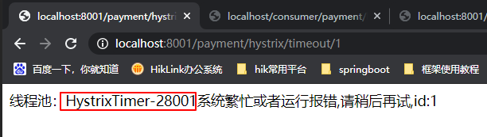

## SpringCloud

### 1.Eureka

> Eureka是SpringCloud的核心组件————服务治理中心，是微服务架构中最基础和最核心的功能组件，主要对各个服务实例进行管理，包括服务注册和服务发现等。
>

#### 使用开启Eureka：

添加依赖后在主启动类上加入@EnableEurekaServer的注解并在配置文件设置对应的参数即可

#### 1.1 注册

```yaml
eureka:
  client:
    register-with-eureka: false #表示不向注册中心注册自己,默认为true
    fetch-registry: false #false表示自己就是注册中心，负责维护服务实例,默认为true
    service-url:
      defaultZone: http://eureka7001.com:7001/eureka/ # 不搭建集群 单机 指向自己
	#defaultZone: http://eureka7002.com:7002/eureka/,http://eureka7001.com:7001/eureka/ # 搭建集群 集群是指向其他eureka
	# 注册任务线程时间间隔，默认为30秒
    instance-info-replication-interval-seconds: 30
    # 首次服务注册延迟时间，默认为40秒
    initial-instance-info-replication-interval-seconds: 40
```

#### 1.2 续约

```yaml
eureka:
  # 微服务实例会按照一定频率对Eureka服务器维持心跳
  instance:
    hostname: eureka7001.com #eureka服务端实例名称,即指向的主机地址
    instance-id: eureka-server-7001 #对应的ID名称
    # 微服务实例续约超时失效秒数，默认值为90秒
    lease-expiration-duration-in-seconds: 90
    # 间隔一定时间执行一次续约服务，默认值为30秒
    lease-renewal-interval-in-seconds: 30
    # 续约超时最大尝试次数，默认为10
    heartbeat-executor-exponential-back-off-bound: 10
```

#### 1.3 下线

当关闭停止微服务后，实例会对Eureka发送下线的REST风格请求，告知服务治理中心，这样客户端就不能再请求这个实例了。同时在Eureka的管理界面上能看到停止的微服务也已不在列表中，说明已经下线了。

#### 1.4 自我保护机制

```yaml
server:
  # 15分钟低于85%的情况下心跳测试失败会出现警告
  enable-self-preservation: false # 关闭自我保护机制 保证不可用服务及时清除
```


#### 1.5 微服务之间的相互调用

##### 服务获取

首先通过eureka.client.fetch-registry判定是否需要检索服务，如果需要就开启一个定时任务去刷新服务实例清单。在定时任务中有两个参数，一个是刷新时间间隔，一个是超时最大尝试次数。

```yaml
client:
  # 当服务获取超时后，最大尝试次数，默认值为10次
  cache-refresh-executor-exponential-back-off-bound: 10
  # 是否执行服务获取，默认为true
  fetch-registry: true
  # 服务获取刷新时间间隔，默认值为30秒
  registry-fetch-interval-seconds: 30
```

#### **1.6 Region和zone**

比如一个跨国大型服务网站放置在杭州的站点可以配置如下。南方的请求就可以主要路由到杭州站点，由杭州站点提供服务，同时杭州站点的微服务实例在相互调用的时候也会采用就近原则，从而提高性能

```yaml
client:
  region: China
  availability-zones: Hangzhou
```

#### 1.7 Eureka注意点

Eureka是一个强调AP（可用性和分区容忍）的组件。通过各种REST风格的请求来监控各个微服务及其他Eureka服务器是否可用，不可用的时候便会剔除它们。如果某个微服务实例发生异常不能使用了，那么Eureka服务器则会通过服务续约机制剔除掉，不再让新的请求路由到这个可能不可用的实例上，从而保证请求能在正常的实例得到处理。

> 服务注册在启动Eureka客户端的时候并不会马上注册到Eureka服务器上，默认情况需要等40秒后才会发送REST风格请求到Eureka服务器请求注册，不成功则会每30秒尝试注册一次
>
> 服务发现在默认的情况下30秒维护一次客户端自己的缓存清单


### 2.OpenFeign

> OpenFeign是一种声明式调用，按照一定的规则描述接口就能够帮助我们完成REST风格的调用，减少代码的编写量，提高代码可读性。规则中完全采用了Spring MVC的风格实现服务调用的功能。

OpenFeign使用步骤：

1.创建OpenFeign的客户端接口

2.在主启动类上声明@EnableFeignClient


Feign工作流程：

> - 首先通过@EnableFeignClient注解开启FeignClient
> - 根据Feign的规则实现接口，并加@FeignClient注解
> - 程序启动后，会进行包扫描，扫描所有的@FeignCleint的注解的类，并将这些信息注入到ioc容器中。
> - 当接口的方法被调用，通过jdk的代理，来生成具体的RequestTemplate
> - RequesTemplate在生成Request
> - Request交给Client去处理
> - 最后Client被封装到LoadBalanceClient类，这个类结合Ribbon做到了负载均衡。


#### 1.Feign客户端超时时间：默认等待一秒钟，超时会异常报错

这里将ribbon的超时时间配置得大于了Hystrix的超时时间，否则hystrix的超时时间就没有意义

```yaml
# Ribbon配置
ribbon:
  # 连接服务器超时时间（单位毫秒）
  connectTimeout: 3000
  # 调用超时时间（单位毫秒），默认1秒
  readTimeout: 6000

# Hystrix配置
hystrix:
  command:
    default:
      execution:
        timeout:
          # 是否启用Hystrix超时时间
          enable: true
        isolation:
          thread:
            # 配置Hystrix断路器超时时间（单位毫秒），默认1秒
            timeoutInMilliseconds: 5000
```

> 配置Ribbon超时原因：底层使用ribbon进行服务间调用


#### 2.配置OpenFeign


##### 2.1 OpenFeign拦截器

###### 实现RequestInterceptor接口，重写apply方法

```java
public class UserInterceptor implements RequestInterceptor {
    /**
     * 拦截器的意义在于，根据自己的需要定制RestTemplate和请求参数、请求体等
     * @param  template -- 请求模板
     */
    @Override
    public void apply(RequestTemplate template) {
        template.header("id", "1");
    }
}
```

> 全局配置，拦截器UserInterceptor可以对OpenFeign客户端接口的所有请求进行拦截，request-interceptors可以配置多个拦截

```yaml
feign:
  client:
    config:
      # “user”代表用户微服务的OpenFeign客户端
      user:
        # 连接远程服务器超时时间（单位毫秒）
        connectTimeout: 5000
        # 读取请求超时时间（单位毫秒）
        readTimeout: 5000
        # 配置拦截器
        request-interceptors:
          - com.spring.cloud.fund.facade.interceptor.UserInterceptor
```

##### 2.2 使用配置类组装OpenFeign组件

```java
@Configuration
public class FeignConfig {
    /**
     *  创建拦截器
     * @return 拦截器
     */
    @Bean
    public RequestInterceptor userInterceptor() {
        return new RequestInterceptor() {
            @Override
            public void apply(RequestTemplate requestTemplate) {
                requestTemplate.header("id",1);
            }
        };
    }

    /**
     * FeignClient日志级别配置
     *
     * @return 日志级别
     */
    @Bean
    public Logger.Level feignLoggerLevel() {
        // 请求和响应的头信息,请求和响应的正文及元数据
        // 日志级别，分为四级：
        // 1. NONE：不记录任何日志（默认值）
        // 2. BASIC：只记录请求方法和URL以及响应状态代码和执行时间，且只记录基本信息及请求和响应头
        // 3. HEADERS：记录基本信息及请求和响应头
        // 4. FULL：记录全部请求头和请求体，并记录请求和相应的各类数据
        return Logger.Level.FULL;
    }
}
```


### 3.Ribbon

> Ribbon是一种客户端负载均衡的组件，主要用于在微服务存在多个实例情况下，进行服务调用的时候需要选取具体的一个实例进行调用，即通过具体的负载均衡算法来实现具体的调用。

#### 3.1 创建RestTemplate的Spring Bean进行开启负载均衡

```java
@Bean
@LoadBalanced//开启负载均衡
public RestTemplate getRestTemplate() {
    return new RestTemplate();
}
```

#### 3.2 使用RestTemplate提供的远程服务调用进行访问其他微服务的接口

例如现在支付模块微服务存在两个实例，访问地址前缀加入该支付模块服务名（spring.application.name）并进行不断的访问便可让Ribbon采用负载均衡策略路由到这两个实例进行调用

```java
private final static String PAYMENT_URL = "http://CLOUD-PAYMENT-SERVICE";//集群
@Autowired
private RestTemplate restTemplate;
@GetMapping("/consumer/payment/get/{id}")
public CommonResult<Payment> getPaymentById(@PathVariable("id") Long id) {
    return restTemplate.getForObject(PAYMENT_URL + "/payment/get/" + id, CommonResult.class, id);
}
```

#### 3.3 负载均衡实现原理

使用LoadBalancerInterceptor对标注@LoadBalanced注解的RestTemplate进行拦截，在其intercept方法调用LoadBalancerClient（SpringBoot在RibbonAutoConfiguration类中自动装配了对象）接口实现类的execute方法执行负载均衡

#### 3.4 负载均衡策略


> **RoundRobinRule** 轮询
> 	**RandomRule** 随机
> 	**AvailabilityFilteringRule** 会先过滤掉由于多次访问故障而处于断路器跳闸状态的服务，还有并发	的连接数超过阈值的服务，然后对剩余的服务列表进行轮询
> 	**WeightedResponseTimeRule** 权重 根据平均响应时间计算所有服务的权重，响应时间越快服务权重越	大被选中的概率越高。刚启动时，如果统计信息不足，则使用轮询策略，等信息足够，切换到 	****
> 	**RetryRule** 重试 先按照轮询策略获取服务，如果获取失败则在指定时间内重试，获取可用服务
> 	**BestAvailableRule** 选过滤掉多次访问故障而处于断路器跳闸状态的服务，然后选择一个并发量最小的服务
> 	**ZoneAvoidanceRule** 符合判断server所在区域的性能和server的可用性选择服务（默认的选择策略，在存在Zone概念且Zone数量大于1的时候，会先过滤掉负载大的或者有故障的服务）

#### 3.5 使用自定义的负载均衡算法

##### 3.5.1 全局配置

```java
@Configuration
public class GlobalConfiguration {
    // 负载均衡策略
    @Bean
    public IRule rule() {
        // 使用随机选择服务的策略
        return new RandomRule();
    }
}
```

##### 3.5.2 局部自定义配置

###### 1.通过yml配置文件设置

IPing接口负责检测服务的心跳（心跳监测类）


通过和Eureka服务治理中心通信的机制来判定（检测服务的心跳）

###### 2.通过使用@RibbonClient注解（FundConfig类不能放在SpringBoot主入口文件可扫描的范围内，否则@RibbonClient优先级低于其配置策略，会对全局生效）


#### 3.6 其他配置

spring.cloud.loadbalancer.retry.enabled默认值为true（Ribbon默认情况下会为我们进行重试请求）

<service-id>.ribbon.xxxx


通过使用饥渴加载Ribbon

第一次Http请求的时候需要初始化Ribbon和发送Http请求，因此会出现耗时比较长的情况。使得第一次服务调用出现超时


### 4.Hystrix

> Hystrix是一种断路器组件，用来保护微服务系统在一些糟糕的情况下尽量保证可用性，保护微服务的运行

为什么需要Hystrix？

> 当正常访问接口时，在同一时间请求少的情况下可以瞬间响应，但在高并发情况下则会产生延迟的现象，特别是在使用Ribbon进行不同微服务间调用的时候出现读取延时错误，导致服务器返回超时错误页面


1. 使用Jmeter在并发量20000下进行对payment服务接口的调用测试

   

2. 此时如果进行跨服务调用，则会出现ribbon读取超时的错误（ribbon读取超时时间设置为5s，默认为1s）

   


#### 4.1 驱动Hystrix模块

1. 导入依赖，在主启动类上加入@EnableCircuitBreaker注解，驱动断路器
2. 在服务模块即controller层里编写逻辑代码
3. 定义用户服务调用接口
4. 使用用户服务调用（通过在方法上加入@HystrixCommand）


```java
@HystrixCommand(fallbackMethod = "paymentInfo_TimeOutHandler", commandProperties = {
            @HystrixProperty(name = "execution.isolation.thread.timeoutInMilliseconds", value = "3000")
    })
    public String paymentInfo_TimeOut(Integer id) {
        int timeNumber = 5;
//        int age = 10 / 0; 模拟系统运行异常
        try {
            TimeUnit.SECONDS.sleep(timeNumber);
        } catch (Exception e) {
            e.printStackTrace();
        }
        return "线程池：" + Thread.currentThread().getName() + "paymentinfo_Timeout,id:" + id + "\t" + "耗时(秒)" + timeNumber;
    }

    private String paymentInfo_TimeOutHandler(Integer id) {
        return "线程池：" + Thread.currentThread().getName() + "8001系统繁忙或者运行报错,请稍后再试,id:" + id + "\t";
    }
```




#### 4.2 配置降级方法

1.在类中编写降级方法


2. 在@FeignClient中指定进行降级处理类的属性（同时在yml文件中配置feign.hystrix.enable为true）

   ```java
   @FeignClient(value = "CLOUD-PROVIDER-HYSTRIX-PAYMENT",fallback = PaymentFallbackService.class)
   ```


#### 4.3 断路器

```java
 @HystrixCommand(
            fallbackMethod = "paymentCircuitBreaker_fallback", commandProperties = {
            @HystrixProperty(name = "circuitBreaker.enabled", value = "true"),// 是否开启断路器
            @HystrixProperty(name = "circuitBreaker.requestVolumeThreshold", value = "10"),// 请求次数
            @HystrixProperty(name = "circuitBreaker.sleepWindowInMilliseconds", value = "10000"),// 时间窗口期/时间范文
            @HystrixProperty(name = "circuitBreaker.errorThresholdPercentage", value = "60")// 失败率达到多少后跳闸
})
```

#### 4.4 Hystrix工作原理


#### 4.5 断路器工作原理


#### 4.6 Hystrix监控


### 5.Zuul

> Zuul是一个API网关，通过网关提供的一系列不同类型的过滤器使得系统维护人员能够快速灵活地过滤服务、限制流量、实现服务器的负载均衡，避免外部请求冲垮微服务系统（与断路器不同，断路器主要是内部服务调用不是外部请求）

#### 5.1 使用步骤

1. 驱动Zuul，在主启动类上加入@EnableZuulProxy注解

2. 在yml文件中添加zuul配置

   ```yaml
   # Zuul的配置
   zuul:
     # 路由配置
     routes:
       # 对应用户微服务
       user-service: # ⑧
         # 请求拦截路径配置（使用ANT风格）
         path: /u/**
         # 通过一个URL配置，实际映射的地址
         url: http://localhost:6001/
         # 通过服务名称配置
         service-id: user
       # 产品微服务配置
       fund-service:
         # 请求拦截路径配置（使用ANT风格）
         path: /p/**
         service-id: product
   ```

   例如通过访问==localhost:1001/u/user/info/1==，就会被映射为：==localhost:6001/u/user/info/1==

   > ANT风格主要使用3个常见的通用字符
   >
   > - "*":匹配一个层级
   > - "**":匹配任意层级
   > - "?":匹配单个字符（/p/? == /p/1）

3. 


#### 5.2 过滤器原理


> ==pre==：在路由到源服务器前执行的逻辑，如鉴权、选择具体的源服务节点等
>
> ==route==：执行路由到源服务器的逻辑
>
> ==post==：在路由到源服务器后执行的过滤器
>
> ==error==：当在整个路由源服务器的执行过程中发生异常时，则进入此类过滤器，可以做全局的响应处理错误的逻辑


正常流程：

请求到达首先会经过pre类型过滤器，而后到达route类型，进行路由，请求就到达真正的服务提供者，执行请求，返回结果后，会到达post过滤器。而后返回响应。

异常流程：

- 整个过程中，pre或者route过滤器出现异常，都会直接进入error过滤器，在error处理完毕后，会将请求交给POST过滤器，最后返回给用户。
- 如果是error过滤器自己出现异常，最终也会进入POST过滤器，将最终结果返回给请求客户端。
- 如果是POST过滤器出现异常，会跳转到error过滤器，但是与pre和route不同的是，请求不会再到达POST过滤器了。

#### 使用Zuul自定义验证码过滤器

```java
@Component // 如果ZuulFilter的子类被装配为Spring Bean，那么会自动注册为Zuul过滤器  ①
public class ValidateCodeFilter extends ZuulFilter {
    // 验证码键和值的参数名称
    private final static String  VALIDATE_KEY_PARAM_NAME = "validateKey";
    private final static String  VALIDATE_CODE_PARAM_NAME = "validateCode";

    // 注入StringRedisTemplate对象，这个对象由Spring Boot自动装配
    @Autowired
    private StringRedisTemplate strRedisTemplate = null;

    @Override
    public String filterType() { // 过滤器类型“pre” ②
        return FilterConstants.PRE_TYPE;
    }

    @Override
    public boolean shouldFilter() { //是否执行过滤器逻辑 ③
        // 获取请求上下文
        RequestContext ctx = RequestContext.getCurrentContext();
        if (ctx.getRequestQueryParams() == null ) { // 如果没有参数，不过滤
            return false;
        }
        // 是否存在对应的参数
        return ctx.getRequestQueryParams()
                .containsKey(VALIDATE_CODE_PARAM_NAME)
                && ctx.getRequestQueryParams()
                .containsKey(VALIDATE_KEY_PARAM_NAME);
    }

    @Override
    public int filterOrder() { // 过滤器的顺序 ⑥
        return FilterConstants.PRE_DECORATION_FILTER_ORDER + 15;
    }

    @Override
    public Object run() throws ZuulException { // 过滤器逻辑 ④
        // 获取请求上下文
        RequestContext ctx = RequestContext.getCurrentContext();
        // 获取请求参数验证key
        String validateKey
                =  ctx.getRequest().getParameter(VALIDATE_KEY_PARAM_NAME);
        // 请求参数验证码
        String validateCode
                =  ctx.getRequest().getParameter(VALIDATE_CODE_PARAM_NAME);
        // Redis缓存的验证码
        String redisValidateCode
                = strRedisTemplate.opsForValue().get(validateKey);
        // 如果两个验证码相同，就放行
        if (validateCode.equals(redisValidateCode)) {
            return null;// 放行
        }
        // 不再放行路由，逻辑到此为止
        ctx.setSendZuulResponse(false);// ⑤
        // 设置响应码为401-未签名
        ctx.setResponseStatusCode(HttpStatus.SC_UNAUTHORIZED);
        // 设置响应类型
        ctx.getResponse()
                .setContentType(MediaType.APPLICATION_JSON_UTF8_VALUE);
        // 响应结果
        ResultMessage result
                = new ResultMessage(false, "验证码错误，请检查您的输入");
        // 将result转换为JSON字符串
        ObjectMapper mapper = new ObjectMapper();
        String body = null;
        try {
            body = mapper.writeValueAsString(result); // 转变为JSON字符串
        } catch (JsonProcessingException e) {
            e.printStackTrace();
        }
        // 设置响应体
        ctx.setResponseBody(body);
        return null;
    }
}
```

### 6.Gateway


#### 6.1 通过yml配置Gateway

```yaml
server:
  port: 9527

spring:
  application:
    name: cloud-gateway
  cloud:
    gateway:
      discovery:
        locator:
          enabled: true # 开启从注册中心动态创建路由的功能，利用微服务名称进行路由
      routes:
        - id: payment_route # 路由的id,没有规定规则但要求唯一,建议配合服务名
          #匹配后提供服务的路由地址
          #          uri: http://localhost:8001
          uri: lb://cloud-payment-service #lb代表从注册中心获取服务
          predicates:
            - Path=/payment/get/** # 断言，路径相匹配的进行路由
              # 时区通过ZonedDateTime.now()生成
              #  2021-09-19T22:32:17.292+08:00[Asia/Shanghai]
              #- After=2021-09-19T22:32:17.292+08:00[Asia/Shanghai]
              #- Before=2021-09-19T22:32:17.292+08:00[Asia/Shanghai]
              #- Cookie=username,zzyy
              #- Header=X-Request-Id, \d+ #请求头要有X-Request-Id属性，并且值为正数
              #- Host=**.space.com
              #- Method=GET
              #- Query=username, \d+ # 要有参数名username并且值还要是正整数才能路由
              # 过滤
              #filters:
            #  - AddRequestHeader=X-Request-red, blue
        - id: payment_route2
          #          uri: http://localhost:8001
          uri: lb://cloud-payment-service
          predicates:
            Path=/payment/lb/** #断言,路径相匹配的进行路由

eureka:
  instance:
    hostname: cloud-gateway-service
  client:
    fetch-registry: true
    register-with-eureka: true
    service-url:
      defaultZone: http://eureka7001.com:7001/eureka/
```

#### 6.2 通过定义全局自定义过滤器配置Gateway

```java
@Component
@Slf4j
public class MyLogGatewayFilter implements GlobalFilter, Ordered {

    @Override
    public Mono<Void> filter(ServerWebExchange exchange, GatewayFilterChain chain) {
        log.info("come in global filter: {}", new Date());

        ServerHttpRequest request = exchange.getRequest();
        String uname = request.getQueryParams().getFirst("uname");
        if (uname == null) {
            log.info("用户名为null，非法用户");
            exchange.getResponse().setStatusCode(HttpStatus.NOT_ACCEPTABLE);
            return exchange.getResponse().setComplete();
        }
        // 放行
        return chain.filter(exchange);
    }

    /**
     * 过滤器加载的顺序 越小,优先级别越高
     *
     * @return
     */
    @Override
    public int getOrder() {
        return 0;
    }
}

```

### 7. Config

> config是一个为微服务提供配置的组件。微服务架构中的实例可能会非常多，如果一个个地更新配置，会极大的增加运维成本，因此这种集中化的配置中心让我们可以统一配置各个微服务实例。

#### 7.1 配置服务端

1. 添加yaml配置
2. 使用@EnableConfigServer注解驱动Config服务端

```yaml
spring:
  cloud:
    config:
      # Config服务端配置
      server:
        # 使用Git，将从Git仓库中读取配置文件
        git:
          # GitHub的URI，将从GitHub
          uri: https://github.com/idealcountry/springcloud
          # 如果你使用的是私有仓库，则需要填写用户密码
          # GitHub用户名
          # username: your-username
          # GitHub密码
          # password: your-password
          # 默认的Git分支，默认值为“master”
          # default-label: master
          # 查找路径，可以配置Git仓库的文件路径，
          # 使用逗号分隔可配置多个路径
          # search-paths: /config
        # 本地文件
#       native:
#         # classpath指向类路径，而/configs代表目录
#         search-locations: classpath:/configs
#  profiles:
#    # 注意，这个配置项一定要配置，
#    # 否则Config服务端会因默认使用Git报错
#    active: native 
```

#### 7.2 配置客户端

```yaml
spring:
  application:
    # 微服务名称
    name: config-client
  cloud:
    # Config服务端配置
    config:
#      # 连接的URI
#      uri: http://localhost:4001
      # 服务发现配置
      discovery:
        # 是否启用服务发现寻找Config服务端
        enabled: true
        # Config服务端serviceId
        serviceId: config-center
      # 是否支持快速失败
      fail-fast: false
      # 使用的分支
      # label: master
      # 登录Config服务端的密码
      password: a123456
      # 登录Config服务端的用户名称
      username: admin

  profiles:
    # 配置版本号
    active:
      - v1
```

通过这样的配置，客户端就可以通过查找服务端配置文件名为==spring.application.name==-==spring.profiles.active==.yml进行获取

查看config服务端配置文件的几种形式

- ip:port/{spring.application.name}/{spring.profiles.active}/{spring.cloud.config.label}
- ip:port/{spring.application.name}/{spring.profiles.active}
- ip:port/{spring.application.name}/{spring.profiles.active}.yml
- ip:port/{spring.cloud.config.label}/{spring.application.name}/{spring.profiles.active}.yml


#### 7.3 监控端点

```yaml
management:
  endpoints:
    web:
      exposure:
        # 暴露的端点
        include : ["health", "configprops"]
        # 不暴露的端点
        exclude : env
```

通过访问ip:port/actuator/health监控config服务端的工作是否安全

ip:port/actuator/configprops来查看Config服务端的相关配置

### 8. Zipkin全链路追踪

> 随着业务的复杂，服务也会慢慢复杂起来，而每个服务又可以有多个实例，一旦发生问题将很难查找问题的根源，因此链路监控组件的诞生可以使得请求能够追踪到各个服务实例中。

使用方法：

1. 在主启动类上添加@EnableZipkinServer注解驱动Zipkin服务器

2. ```yaml
   spring:
     application:
       name: sleuth-provider
     sleuth:
       sampler: # 样本配置
         # 百分比，默认为0.1
         probability: 1.0
         # 速率，每秒30次追踪
         # rate: 30
     zipkin:
       base-url: http://localhost:5001
   ```

通过访问ip:port/zipkin/进行查看服务

##### 通过Elasticsearch和kibana查看持久化的链路样本

```yaml
## zipkin配置
zipkin:
  storage:
#    # mysql作为存储类型
#    type: mysql
    # 使用ElasticSearch作为存储类型
    type: elasticsearch
    # ElasticSearch配置
    elasticsearch:
      # 索引
      index: zipkin
      # 最大请求数
      max-requests: 64
      # 索引分片数
      index-shards: 5
      # 索引复制数
      index-replicas: 1
      # 服务器和端口
      hosts: localhost:9200
```


> 当使用作者给的代码在console中运行时发现只有demolog之类的信息，通过百度后发现使用该命令即可查询

```http
GET /zipkin*/_search
```

### 9. 微服务监控——Admin

> Admin是一个监控平台，它可以检测各个SpringBoot应用，让运维和开发人员及时发现各个服务实例存在的问题，主要通过Actuator暴露的端点来检测各个实例的运行状况

#### 9.1 Admin服务端开发

导入相关依赖后在主启动类上加入@EnableAdminServer驱动Admin服务端即可

```yaml
spring:
  application:
    # 配置Spring服务名称
    name: admin-server
```

#### 9.2 Admin客户端开发

```yaml
spring:
  application:
    # 配置服务名称
    name: admin-client
  boot:
    # Spring Boot Admin配置
    admin:
      client:
        # 服务器的注册地址 ①
        url: http://localhost:9001

# Actuator端点暴露
management:
  endpoints:
    web:
      exposure:
        # 配置Actuator暴露那些端点  ②
        include: '*'
```

启动服务与客户端模块后通过在9001端口访问便可查看Admin服务端监测平台
